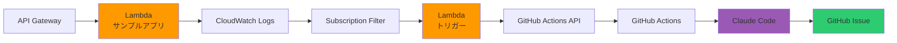

# LLM Ops Demo - CloudWatch + GitHub Actions + Claude Code

CloudWatchからのエラー通知を自動的にClaude Codeで解析し、GitHub Issueとして報告するデモシステムです。

## 🏗️ アーキテクチャ



## 📋 主な機能

1. **エラー検知**: API Gateway + Lambda構成のサンプルアプリケーションで発生したエラーを自動検知
2. **ログ収集**: CloudWatch Logsに構造化ログを自動送信
3. **自動トリガー**: エラーログを検知してGitHub Actionsを自動起動
4. **AI解析**: Claude Codeがリポジトリのコンテキストを理解してエラーを解析
5. **Issue作成**: 解析結果を含むGitHub Issueを自動作成

## 🚀 クイックスタート

### 前提条件

- AWSアカウント
- GitHubアカウント
- Claude Code（Maxプランのサブスクリプション）
- Node.js 22.x
- AWS CLI設定済み

### セットアップ

1. **リポジトリのクローン**

```bash
git clone https://github.com/your-username/llm-ops.git
cd llm-ops
```

2. **依存関係のインストール**

```bash
npm install
```

3. **環境変数の設定**

`.env.example`をコピーして`.env`を作成し、必要な情報を入力:

```bash
cp .env.example .env
```

```.env
AWS_REGION=ap-northeast-1
AWS_ACCOUNT_ID=your-account-id
GITHUB_TOKEN=your-github-token
GITHUB_OWNER=your-github-username
GITHUB_REPO=llm-ops
```

4. **デプロイ**

```bash
npm run deploy
```

デプロイが完了すると、API GatewayのURLが表示されます。

### テスト

エラーエンドポイントにアクセスしてエラーを発生させます:

```bash
# Null参照エラー
curl https://your-api-id.execute-api.ap-northeast-1.amazonaws.com/dev/error/null-reference

# 型エラー
curl https://your-api-id.execute-api.ap-northeast-1.amazonaws.com/dev/error/type-error

# 非同期エラー
curl https://your-api-id.execute-api.ap-northeast-1.amazonaws.com/dev/error/async-error
```

数秒後、GitHubリポジトリにIssueが自動作成され、Claude Codeによる解析が開始されます。

## 📚 ドキュメント

詳細なセットアップ手順とテスト方法については、以下のドキュメントを参照してください:

- [環境構築ガイド](docs/01-setup-guide.md)
- [デプロイ手順](docs/02-deployment.md)
- [テスト手順](docs/03-testing.md)

## 🔧 技術スタック

- **AWS Lambda**: サーバーレス実行環境
- **API Gateway**: RESTful APIエンドポイント
- **CloudWatch Logs**: ログ収集・監視
- **GitHub Actions**: CI/CDワークフロー
- **Claude Code**: AI駆動のコード解析
- **TypeScript**: 型安全な開発

## 📝 ライセンス

MIT
