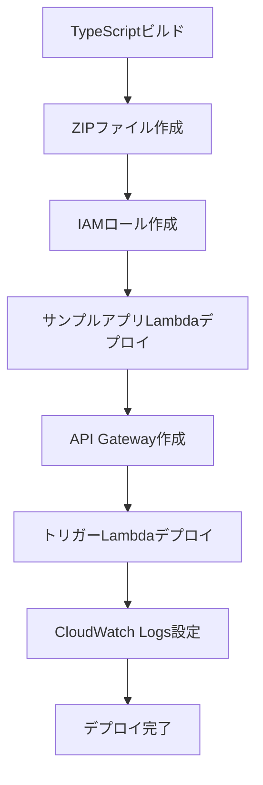

# デプロイ手順

このガイドでは、LLM Opsデモ環境をAWSにデプロイする手順を説明します。

## 前提条件

[環境構築ガイド](01-setup-guide.md)の手順を完了していることを確認してください。

## デプロイの流れ



## 自動デプロイ（推奨）

### 1. デプロイスクリプトの実行

プロジェクトルートで以下のコマンドを実行:

```powershell
npm run deploy
```

このコマンドは以下の処理を自動的に実行します:

1. ✅ TypeScriptコードのビルド
2. ✅ Lambda関数用のZIPファイル作成
3. ✅ IAMロールの作成
4. ✅ サンプルアプリLambda関数のデプロイ
5. ✅ API Gatewayの作成と設定
6. ✅ トリガーLambda関数のデプロイ
7. ✅ CloudWatch Logsサブスクリプションフィルターの設定

### 2. デプロイ結果の確認

デプロイが成功すると、以下のような出力が表示されます:

```
=== Deployment Completed Successfully! ===

API Gateway URL: https://xxxxxxxxxx.execute-api.ap-northeast-1.amazonaws.com/dev

Test endpoints:
  - Health check: https://xxxxxxxxxx.execute-api.ap-northeast-1.amazonaws.com/dev/
  - Null reference error: https://xxxxxxxxxx.execute-api.ap-northeast-1.amazonaws.com/dev/error/null-reference
  - Type error: https://xxxxxxxxxx.execute-api.ap-northeast-1.amazonaws.com/dev/error/type-error
  - Async error: https://xxxxxxxxxx.execute-api.ap-northeast-1.amazonaws.com/dev/error/async-error
  - Custom error: https://xxxxxxxxxx.execute-api.ap-northeast-1.amazonaws.com/dev/error/custom (POST)
```

**API Gateway URLをメモしてください。** テスト時に使用します。

### 3. AWSマネジメントコンソールで確認

#### Lambda関数の確認

1. AWSマネジメントコンソールにログイン
2. Lambda → 関数 に移動
3. 以下の関数が作成されていることを確認:
   - `llm-ops-sample-app`
   - `llm-ops-trigger-workflow`

#### API Gatewayの確認

1. API Gateway → API に移動
2. `llm-ops-demo-api` が作成されていることを確認
3. ステージ → dev をクリックして、URLを確認

#### CloudWatch Logsの確認

1. CloudWatch → ロググループ に移動
2. `/aws/lambda/llm-ops-sample-app` が作成されていることを確認
3. サブスクリプションフィルター → `error-detection-filter` が設定されていることを確認

## 手動デプロイ（オプション）

個別のコンポーネントをデプロイする場合は、以下のコマンドを使用できます:

### サンプルアプリのみデプロイ

```powershell
npm run deploy:sample-app
```

### トリガーLambdaのみデプロイ

```powershell
npm run deploy:trigger
```

## GitHub Secretsの設定

> [!IMPORTANT]
> この手順は**必須**です。GitHub ActionsがClaude Codeを呼び出すために必要です。

1. GitHubリポジトリのページを開く

2. Settings → Secrets and variables → Actions をクリック

3. 「New repository secret」をクリック

4. 以下のSecretを追加:

| Name | Value | 説明 |
|------|-------|------|
| `AWS_REGION` | `ap-northeast-1` | AWSリージョン |
| `AWS_ACCOUNT_ID` | `123456789012` | AWSアカウントID |

> [!NOTE]
> `GITHUB_TOKEN`は自動的に提供されるため、設定不要です。

## Claude CodeのGitHub App権限設定

1. GitHubリポジトリのページを開く

2. Settings → Integrations → GitHub Apps をクリック

3. 「Claude for GitHub」が表示されていることを確認

4. 権限を確認:
   - ✅ Issues: Read & Write
   - ✅ Contents: Read
   - ✅ Metadata: Read

権限が不足している場合は、Claude.aiの設定から再度連携してください。

## デプロイの確認

### 1. ヘルスチェック

```powershell
curl https://your-api-id.execute-api.ap-northeast-1.amazonaws.com/dev/
```

以下のようなレスポンスが返ればOKです:

```json
{
  "status": "healthy",
  "message": "LLM Ops Demo - Sample Application",
  "timestamp": "2025-11-26T08:00:00.000Z",
  "endpoints": [...]
}
```

### 2. Lambda関数のログ確認

```powershell
aws logs tail /aws/lambda/llm-ops-sample-app --follow
```

ログがリアルタイムで表示されることを確認してください。

### 3. トリガーLambdaの環境変数確認

```powershell
aws lambda get-function-configuration --function-name llm-ops-trigger-workflow
```

`Environment.Variables`に以下が設定されていることを確認:
- `GITHUB_TOKEN`
- `GITHUB_OWNER`
- `GITHUB_REPO`

## トラブルシューティング

### デプロイスクリプトがエラーで停止する

**エラー**: `Access Denied`

→ IAMユーザーに必要な権限が付与されているか確認してください。

**エラー**: `Role cannot be assumed`

→ IAMロールの作成直後は、権限の伝播に時間がかかる場合があります。数分待ってから再実行してください。

### API Gatewayにアクセスできない

**エラー**: `{"message":"Internal server error"}`

→ Lambda関数のログを確認してください:

```powershell
aws logs tail /aws/lambda/llm-ops-sample-app --since 5m
```

### CloudWatch Logsサブスクリプションフィルターが動作しない

1. サブスクリプションフィルターが正しく設定されているか確認:

```powershell
aws logs describe-subscription-filters --log-group-name /aws/lambda/llm-ops-sample-app
```

2. トリガーLambdaの権限を確認:

```powershell
aws lambda get-policy --function-name llm-ops-trigger-workflow
```

`logs.amazonaws.com`からの呼び出し権限があることを確認してください。

## 次のステップ

デプロイが完了したら、[テスト手順](03-testing.md)に進んでください。

## クリーンアップ

デモ環境を削除する場合は、以下のリソースを手動で削除してください:

1. Lambda関数:
   - `llm-ops-sample-app`
   - `llm-ops-trigger-workflow`

2. API Gateway:
   - `llm-ops-demo-api`

3. IAMロール:
   - `llm-ops-sample-app-role`
   - `llm-ops-trigger-role`

4. CloudWatch Logsロググループ:
   - `/aws/lambda/llm-ops-sample-app`
   - `/aws/lambda/llm-ops-trigger-workflow`
