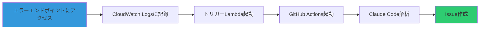

# テスト手順

このガイドでは、LLM Opsデモ環境のエンドツーエンドテストを実施する手順を説明します。

## 前提条件

- [環境構築ガイド](01-setup-guide.md)を完了
- [デプロイ手順](02-deployment.md)を完了
- API Gateway URLを取得済み

## テストの流れ



## フェーズ1: API Gatewayの動作確認

### 1. ヘルスチェック

```powershell
curl https://your-api-id.execute-api.ap-northeast-1.amazonaws.com/dev/
```

**期待される結果**:

```json
{
  "status": "healthy",
  "message": "LLM Ops Demo - Sample Application",
  "timestamp": "2025-11-26T08:00:00.000Z",
  "endpoints": [
    "GET / - ヘルスチェック",
    "GET /error/null-reference - Null参照エラー",
    "GET /error/type-error - 型エラー",
    "GET /error/async-error - 非同期エラー",
    "POST /error/custom - カスタムエラー (body: { message: string })"
  ]
}
```

### 2. CloudWatch Logsの確認

別のPowerShellウィンドウでログを監視:

```powershell
aws logs tail /aws/lambda/llm-ops-sample-app --follow
```

このウィンドウは開いたままにしておきます。

## フェーズ2: エラー発生とログ確認

### 1. Null参照エラーのテスト

```powershell
curl https://your-api-id.execute-api.ap-northeast-1.amazonaws.com/dev/error/null-reference
```

**期待される動作**:

1. HTTPステータス500が返る
2. CloudWatch Logsにエラーログが記録される

**CloudWatch Logsの出力例**:

```json
{
  "timestamp": "2025-11-26T08:00:00.000Z",
  "context": "GET /error/null-reference",
  "error": {
    "name": "TypeError",
    "message": "Cannot read properties of null (reading 'property')",
    "stack": "TypeError: Cannot read properties of null...\n    at triggerNullReferenceError..."
  },
  "severity": "ERROR"
}
```

### 2. 型エラーのテスト

```powershell
curl https://your-api-id.execute-api.ap-northeast-1.amazonaws.com/dev/error/type-error
```

### 3. 非同期エラーのテスト

```powershell
curl https://your-api-id.execute-api.ap-northeast-1.amazonaws.com/dev/error/async-error
```

### 4. カスタムエラーのテスト

```powershell
curl -X POST https://your-api-id.execute-api.ap-northeast-1.amazonaws.com/dev/error/custom `
  -H "Content-Type: application/json" `
  -d '{"message":"これはデモ用のカスタムエラーです"}'
```

## フェーズ3: トリガーLambdaの動作確認

### 1. トリガーLambdaのログ確認

新しいPowerShellウィンドウを開き、トリガーLambdaのログを監視:

```powershell
aws logs tail /aws/lambda/llm-ops-trigger-workflow --follow
```

### 2. エラーを再度発生させる

```powershell
curl https://your-api-id.execute-api.ap-northeast-1.amazonaws.com/dev/error/null-reference
```

### 3. トリガーLambdaの実行を確認

トリガーLambdaのログに以下のような出力が表示されることを確認:

```
CloudWatch Logs event received: {...}
Decompressed log data: {...}
Triggering GitHub Actions with payload: {
  "error_message": "Cannot read properties of null (reading 'property')",
  "error_stack": "TypeError: Cannot read properties of null...",
  "error_type": "TypeError",
  ...
}
GitHub Actions triggered successfully
```

> [!NOTE]
> CloudWatch Logsサブスクリプションフィルターは、ログが記録されてから数秒後にトリガーされます。

## フェーズ4: GitHub Actions統合テスト

### 1. GitHub Actionsの実行確認

1. GitHubリポジトリのページを開く
2. 「Actions」タブをクリック
3. 「Error Analysis with Claude Code」ワークフローが実行されていることを確認

**ワークフローの実行状態**:
- 🟡 実行中（黄色）
- ✅ 成功（緑色）
- ❌ 失敗（赤色）

### 2. ワークフローの詳細確認

1. 実行中のワークフローをクリック
2. 「analyze-error」ジョブをクリック
3. 各ステップの実行状況を確認:
   - ✅ Checkout repository
   - ✅ Extract error information
   - ✅ Create error analysis prompt
   - ✅ Create Issue with error details

### 3. GitHub Issueの確認

1. GitHubリポジトリの「Issues」タブを開く
2. 新しいIssueが作成されていることを確認

**Issueのタイトル例**:
```
[自動検知] TypeError: Cannot read properties of null (reading 'property')
```

**Issueの内容**:
- エラー情報のテーブル
- スタックトレース
- Claude Codeへのメンション（`@claude-code`）

## フェーズ5: Claude Code解析の確認

### 1. Claude Codeの応答を待つ

Issueが作成されてから数分以内に、Claude Codeがコメントを追加します。

### 2. 解析レポートの確認

Claude Codeのコメントには、以下の内容が含まれます:

1. **根本原因の分析**
   - エラーが発生した理由
   - 問題のあるコード箇所の特定

2. **影響範囲の評価**
   - どの機能が影響を受けるか
   - ユーザーへの影響

3. **修正方法の提案**
   - 具体的なコード変更
   - 修正の優先度

4. **再発防止策**
   - テストの追加
   - コードレビューのポイント

### 3. 解析品質の評価

以下の観点で解析レポートの品質を確認:

- ✅ リポジトリのコードを正しく理解しているか
- ✅ エラーの根本原因を特定できているか
- ✅ 実装可能な修正方法を提案しているか
- ✅ 再発防止策が具体的か

## エンドツーエンドテスト

### 完全なフローのテスト

1. **準備**: 3つのPowerShellウィンドウを開く
   - ウィンドウ1: サンプルアプリのログ監視
   - ウィンドウ2: トリガーLambdaのログ監視
   - ウィンドウ3: curlコマンド実行用

2. **エラー発生**:
```powershell
# ウィンドウ3で実行
curl https://your-api-id.execute-api.ap-northeast-1.amazonaws.com/dev/error/type-error
```

3. **ログ確認**:
   - ウィンドウ1: エラーログが記録される（即座）
   - ウィンドウ2: トリガーLambdaが実行される（数秒後）

4. **GitHub確認**:
   - Actions: ワークフローが実行される（数秒後）
   - Issues: 新しいIssueが作成される（約30秒後）

5. **Claude Code確認**:
   - Issue: Claude Codeのコメントが追加される（数分後）

### タイムライン

```
0秒    : エラーエンドポイントにアクセス
0-1秒  : CloudWatch Logsに記録
3-5秒  : トリガーLambda実行
5-10秒 : GitHub Actions起動
10-30秒: Issue作成
1-5分  : Claude Code解析完了
```

## トラブルシューティング

### GitHub Actionsが起動しない

**確認事項**:

1. トリガーLambdaのログを確認:
```powershell
aws logs tail /aws/lambda/llm-ops-trigger-workflow --since 10m
```

2. 環境変数を確認:
```powershell
aws lambda get-function-configuration --function-name llm-ops-trigger-workflow
```

3. GitHub Tokenの権限を確認:
   - Settings → Developer settings → Personal access tokens
   - `repo`と`workflow`スコープが有効か確認

### Issueが作成されない

**確認事項**:

1. GitHub Actionsのログを確認:
   - Actions → 最新のワークフロー → ログを確認

2. `GITHUB_TOKEN`の権限を確認:
   - Settings → Actions → General → Workflow permissions
   - 「Read and write permissions」が選択されているか確認

### Claude Codeが応答しない

**確認事項**:

1. Claude CodeのGitHub連携を確認:
   - Settings → Integrations → GitHub Apps
   - 「Claude for GitHub」が有効か確認

2. Issueで`@claude-code`がメンションされているか確認

3. Claude Codeの権限を確認:
   - Issues: Read & Write
   - Contents: Read

## デモ用のテストシナリオ

社内デモで使用する場合の推奨シナリオ:

### シナリオ1: 基本的なエラー検知

1. ヘルスチェックで正常動作を確認
2. Null参照エラーを発生
3. CloudWatch Logsでエラーを確認
4. GitHub Issueが自動作成されることを確認
5. Claude Codeの解析レポートを確認

### シナリオ2: 複数エラーの同時処理

1. 3種類のエラーを連続で発生
2. それぞれのエラーに対してIssueが作成されることを確認
3. Claude Codeが各エラーを個別に解析することを確認

### シナリオ3: カスタムエラーメッセージ

1. カスタムエラーエンドポイントを使用
2. 業務に即したエラーメッセージを送信
3. Claude Codeが文脈を理解して解析することを確認

## 次のステップ

テストが完了したら、以下を検討してください:

1. **本番環境への適用**
   - 実際のアプリケーションにCloudWatch Logs統合を追加
   - エラーログのフォーマットを統一

2. **カスタマイズ**
   - エラーの重要度に応じたラベル付け
   - Slackなどへの通知追加
   - Claude Codeの解析プロンプトのカスタマイズ

3. **モニタリング**
   - CloudWatch Dashboardの作成
   - エラー発生率のメトリクス化
